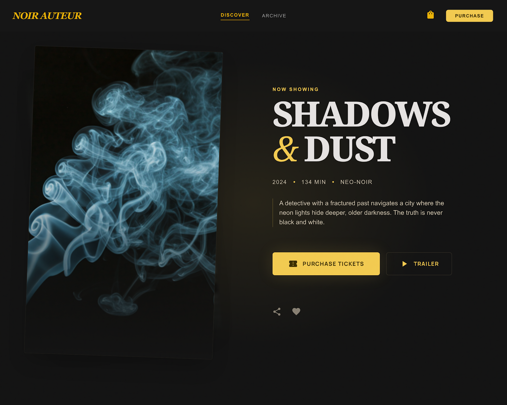

# Noir Auteur - Cinematic Movie Experience 🎬

> **"Experience high-quality cinema from your pocket."**

Noir Auteur is a premium, high-conversion movie web application tailored for the Egyptian market. It features a sophisticated "Swipe to Buy" interface inspired by modern entertainment apps, designed to provide a seamless and visually stunning browsing experience.

---

## ✨ Key Features | المميزات
- **Premium Cinematic UI:** Designed with a noir-inspired aesthetic, featuring vibrant gradients and smooth animations.
- **RTL Language Support:** Fully localized experience in Arabic (Egyptian dialect) for maximum engagement.
- **Intelligent WhatsApp Integration:** Dynamic messaging that handles orders and inquiries directly through WhatsApp.
- **Micro-Animations:** Fluid transitions, film-grain overlays, and drifting backgrounds for a truly immersive feel.
- **Mobile First:** Optimized for a perfect experience on all mobile devices.

---

## 📽️ UI Screenshots | معاينة الواجهة

---

## 🛠️ Technical Overview | نظرة تقنية
- **Frontend:** HTML5, TailwindCSS (CDN), Vanilla JavaScript.
- **Styling:** Custom CSS animations and Material Symbols Outlined icons.
- **Data Driven:** Powered by a local metadata system (`movies.js`) for lightning-fast performance.

---

## 🛡️ Privacy & Proprietary Code
This repository is **Private**. The source code is proprietary and not open for public modification. The live version is hosted for viewing purposes only.

---

## 🚀 Deployment
Hosted via **GitHub Pages** for reliable and fast access.

---

© 2026 Noir Auteur. All Rights Reserved.
